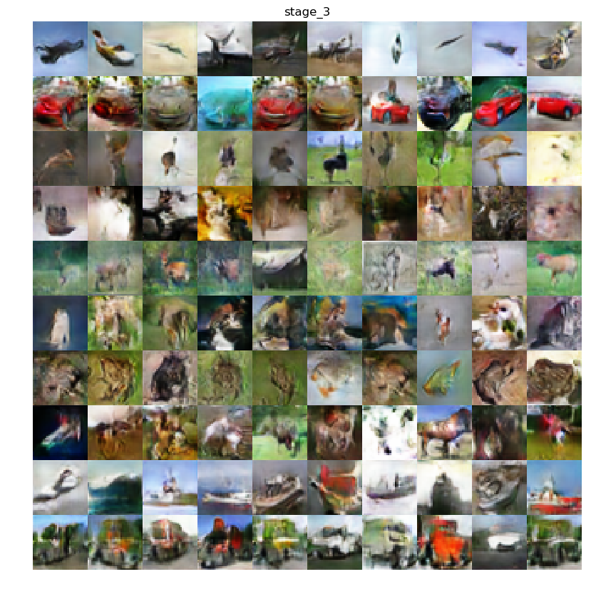

# Implementation of progressive groving of GANs with Keras + tensorflow (tpu support)

This repository contains the partial implementation of [progressive groving of GANs](https://arxiv.org/abs/1710.10196).
The code supports different type of GAN objective functions (for more information see [adversarials.py](adversarials.py)), 
historical buffer, mixup and training using [Google Colab TPU](https://cloud.google.com/tpu/). 
The implementation could be used for tasks of image generation, style transfer 
and even [improving the accuracy](https://arxiv.org/abs/1811.12231) of the image classifier.

The code is tested on [cifar-10](https://www.cs.toronto.edu/~kriz/cifar.html) dataset. 

---
This project is the part of the datascience portfolio. Other projects can be found here:
* [Implementation of PPO algorithm for reinforcement learning with Keras + tensorflow](https://github.com/plotnikov938/ppo_keras_tf)
* [Text classification using CapsNet and multihead relative attention with Keras + tensorflow](https://github.com/plotnikov938/txt_class_keras_tf)
---

## Table of Contents
  * [Limitations](#limitations)
  * [Installation](#installation)
  * [Training](#training)
    + [Training progress](#training-progress)
    + [Losses](#losses)
  * [Usage](#usage)
  * [Results](#results)
  * [Resources](#resources)    
  * [Contacts](#contacts)
  
## Limitations
The implementation does support training on Google Colab TPU and because of that there are some several limitations:
1. The losses with Gradient Penalty and Lipschitz Penalty are not supported on TPUs.
2. To use losses with gradient penalty on GPU or CPU, the image size of each subsequent stage must be twice as large
than previous (e.g. 4x4 -> 8x8).
3. Historical buffer is not supported on TPUs.
4. Weight scaling is not yet supported as it was proposed in the original paper because of TPUs,
 but instead you could specify the learning rate for each training stage individually (see [config.py](config.py)).  
5. Minibatch standard deviation works with one group only.
6. The model cannot be saved, only the weights. The weights are saved as a numpy array.
7. Due to the unstable learning process on TPUs at a later stages, it is recommended to use 
larger batch size and lower learning rate.

## Installation

Make sure you use Python 3.

Clone this repo to your local machine
```
$ git clone https://github.com/plotnikov938/pg_gans_keras_tf.git
```
Go into the project directory
```
$ cd pg_gan_keras_tf/
```
Create a virtual environment if needed:
```
$ python3 -m venv env
```
Use the package manager pip to install requirements.
```
$ pip3 install -r requirements.txt
```

## Training    
Edit [config.py](config.py) to specify the base configuration or create a new config.py in the desire location.

Run the training script. For instance, if new config.py were created under the name `config_new.py`, run:
```
$ python3 train.py --path-config /config_new.py
```
The weights for the configured model will be saved to the newly created subdirectory `./weights` as `./generator.npz` 
and `./discriminator.npz`

The code is tested on [cifar-10](https://www.cs.toronto.edu/~kriz/cifar.html) dataset. 

### Training progress

<p align="center">
    
</p>

### Losses    

<label for="stage-select">Choose a training stage:</label>

<select id="stage-select" onchange="var link = 'losses/gan_losses_';
document.getElementById('img_losses').src=link + this.value;">
    <option value="0.jpg">Stage 1</option>
    <option value="1.jpg">Stage 2</option>
    <option value="2.jpg">Stage 3</option>
    <option selected value="3.jpg">Stage 4</option>
</select>

<p align="center"> The loss plot for the selected training stage</p>

<p align="center">
    
</p>

## Usage
```
usage: run.py [-h] [--path_config PATH_CONFIG] [-f FILENAME] [-s]
              [-l {-2,-1,0,1,2,3,4,5,6,7,8,9}]
              [--stage_nums [STAGE_NUMS [STAGE_NUMS ...]]]

optional arguments:
  -h, --help            show this help message and exit
  --path_config
                        a path to the config.py
  -f, --filename
                        a filename to save generated images
  -s, --show            show generated images
  -l, --label
                        Use this option in case the model was trained conditionally:
                           [0-9] - generate images with selected label
                           -1 (default) - generate images for each label presented
                           -2 - generate randomly labeled images
  --stage_nums
                        defines the stages for which images will be generated
```


To simply generate images with random labels and the size of the last stage, run:
```
$ python3 run.py --show --labels -2
```
The generated images will be automatically saved to the `./results` folder.

Use `--filename` key to specify filename of the generated images.
In order to specify stages number or , run:

If you want to generate images for each stage and for each label presented, run:
```
$ python3 run.py --show --stage_nums 0 1 2 3
```

## Results
<label for="stage-select2">Choose a training stage:</label>

<select id="stage-select2" onchange="var link = 'results/';
document.getElementById('img_results').src=link + this.value;">
    <option value="0_gan.png">Stage 1</option>
    <option value="1_gan.png">Stage 2</option>
    <option value="2_gan.png">Stage 3</option>
    <option selected value="3_gan.png">Stage 4</option>
</select>

<p align="center"> The generated images for the selected training stage</p>

<p align="center">
    
</p>

## Resources
1. [Generative Adversarial Networks](https://arxiv.org/abs/1406.2661)
2. [Progressive Growing of GANs for Improved Quality, Stability, and Variation](https://arxiv.org/abs/1710.10196)
3. [mixup: Beyond Empirical Risk Minimization](https://arxiv.org/abs/1710.09412)
4. [Learning from Simulated and Unsupervised Images through Adversarial Training](https://arxiv.org/pdf/1612.07828.pdf)

## Contacts
Please contact me if you have any questions:  [plotnikov.ilia938@gmail.com](mailto:plotnikov.ilia938@gmail.com)
